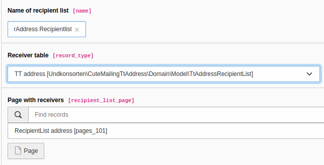

[](https://github.com/undkonsorten/typo3-cute-mailing-ttaddress/actions/workflows/publish.yml)
# typo3-cute-mailing-ttaddress

This extension adds [tt_address](https://github.com/FriendsOfTYPO3/tt_address) as recipient list to [typo3-cute-mailing](https://github.com/undkonsorten/typo3-cute-mailing)



## Running tests

Tests are executed inside Docker containers via `Build/Scripts/runTests.sh`. Docker must be installed and running.

### Prerequisites

Install the Composer dependencies first:

```bash
./Build/Scripts/runTests.sh -s composerUpdateMax
```

To target a specific TYPO3 version:

```bash
./Build/Scripts/runTests.sh -t 13.4 -s composerUpdateMax
./Build/Scripts/runTests.sh -t 14.3 -s composerUpdateMax
```

### PHP linting

Check all PHP files for syntax errors:

```bash
./Build/Scripts/runTests.sh -s lintPhp
```

### Unit tests

```bash
./Build/Scripts/runTests.sh -s unit
```

### Functional tests

Run with the default SQLite backend:

```bash
./Build/Scripts/runTests.sh -s functional
```

Run against MySQL or PostgreSQL:

```bash
./Build/Scripts/runTests.sh -s functional -d mysql
./Build/Scripts/runTests.sh -s functional -d postgres
```

### Code style (PHP-CS-Fixer)

Check for style violations (dry-run, shows a diff, doesn't change files):

```bash
./Build/Scripts/runTests.sh -s cgl -n
```

Actually fix them:

```bash
./Build/Scripts/runTests.sh -s cgl
```

### Code metrics (PHPMD)

```bash
./Build/Scripts/runTests.sh -s phpmd
```

### Options

| Option | Description | Default |
|--------|-------------|---------|
| `-s <suite>` | Test suite: `lintPhp`, `unit`, `unitRandom`, `functional`, `cgl`, `phpmd`, `composerUpdateMin`, `composerUpdateMax` | `unit` |
| `-p <version>` | PHP version: `8.1`, `8.2`, `8.3`, `8.4`, `8.5` | `8.3` |
| `-t <version>` | TYPO3 version (for composer steps): `12.4`, `13.4`, `14.3` | `14.3` |
| `-d <dbms>` | Database for functional tests: `sqlite`, `mysql`, `mariadb`, `postgres` | `sqlite` |
| `-b <runtime>` | Container runtime: `docker`, `podman` | auto-detected |
| `-x` | Enable Xdebug (PhpStorm on port 9003) | off |

Full option reference:

```bash
./Build/Scripts/runTests.sh -h
```
